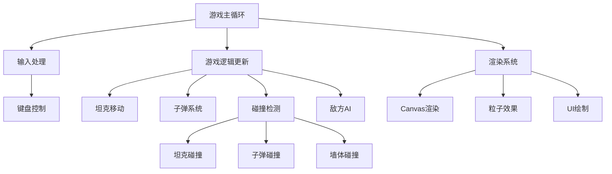

# 坦克大战网页游戏实现计划

一个经典的坦克大战游戏，采用纯HTML5 Canvas + JavaScript实现，具有精美的视觉效果和流畅的游戏体验。

## 游戏特性

- **经典玩法**：玩家控制坦克，保护基地，消灭敌方坦克
- **精美视觉**：使用Canvas绘制，添加爆炸动画和粒子效果
- **智能AI**：敌方坦克具有基本的寻路和攻击逻辑
- **关卡系统**：支持多关卡，难度递增
- **响应式设计**：适配不同屏幕尺寸

## 技术架构

### 核心技术栈
- **HTML5 Canvas**：游戏渲染引擎
- **原生JavaScript**：游戏逻辑（ES6+）
- **CSS3**：UI样式和动画
- **Web Audio API**：音效系统（可选）

### 游戏架构设计



## 建议的改进方向

> [!NOTE]
> 以下是一些可选的增强功能，可以在基础版本完成后添加：
> - 道具系统（加速、护盾、强化子弹）
> - 本地存储的最高分记录
> - 双人对战模式
> - 更多地图和关卡设计
> - 背景音乐和音效

## 实现变更

### 游戏核心模块

#### [NEW] [index.html](file:///Users/georgezhong/Documents/03-AI-Tutorial/cursor-tutorial/tank-game/index.html)
- 游戏主页面结构
- Canvas画布容器
- 游戏UI元素（开始按钮、分数显示等）
- 引入样式和脚本文件

#### [NEW] [style.css](file:///Users/georgezhong/Documents/03-AI-Tutorial/cursor-tutorial/tank-game/style.css)
- 现代化设计系统
- 深色主题配色
- 游戏UI样式（按钮、面板、HUD）
- 响应式布局
- 动画效果（渐变、过渡）

#### [NEW] [game.js](file:///Users/georgezhong/Documents/03-AI-Tutorial/cursor-tutorial/tank-game/game.js)
- 游戏主循环和状态管理
- Canvas初始化和渲染系统
- 游戏场景管理（开始、游戏中、结束）
- 分数和关卡系统

---

### 游戏实体类

#### [NEW] [tank.js](file:///Users/georgezhong/Documents/03-AI-Tutorial/cursor-tutorial/tank-game/tank.js)
- `Tank` 基类：坦克的基本属性和方法
  - 位置、方向、速度
  - 移动和旋转逻辑
  - 生命值管理
  - 渲染方法
- `PlayerTank` 类：玩家坦克
  - 键盘输入处理
  - 射击控制
- `EnemyTank` 类：敌方坦克
  - AI移动逻辑
  - 自动射击
  - 寻路算法

#### [NEW] [bullet.js](file:///Users/georgezhong/Documents/03-AI-Tutorial/cursor-tutorial/tank-game/bullet.js)
- `Bullet` 类：子弹系统
  - 子弹移动和方向
  - 子弹渲染
  - 生命周期管理

#### [NEW] [map.js](file:///Users/georgezhong/Documents/03-AI-Tutorial/cursor-tutorial/tank-game/map.js)
- `Map` 类：地图和障碍物系统
  - 地图数据结构（二维数组）
  - 墙体类型（砖墙、钢墙、水域）
  - 基地位置和保护
  - 地图渲染

---

### 工具模块

#### [NEW] [collision.js](file:///Users/georgezhong/Documents/03-AI-Tutorial/cursor-tutorial/tank-game/collision.js)
- 碰撞检测系统
  - 矩形碰撞检测
  - 坦克与墙体碰撞
  - 子弹与坦克碰撞
  - 子弹与墙体碰撞

#### [NEW] [effects.js](file:///Users/georgezhong/Documents/03-AI-Tutorial/cursor-tutorial/tank-game/effects.js)
- 视觉效果系统
  - 爆炸动画
  - 粒子效果
  - 特效渲染

#### [NEW] [utils.js](file:///Users/georgezhong/Documents/03-AI-Tutorial/cursor-tutorial/tank-game/utils.js)
- 工具函数
  - 数学计算辅助函数
  - 随机数生成
  - 方向转换

## 验证计划

### 自动化测试
```bash
# 启动本地开发服务器
cd /Users/georgezhong/Documents/03-AI-Tutorial/cursor-tutorial/tank-game
python3 -m http.server 8000
```

### 手动验证
1. **基础功能测试**
   - 玩家坦克移动（WASD或方向键）
   - 射击功能（空格键）
   - 敌方坦克生成和移动
   
2. **游戏逻辑测试**
   - 碰撞检测准确性
   - 分数计算正确性
   - 关卡推进逻辑
   - 游戏结束条件
   
3. **视觉效果测试**
   - 爆炸动画流畅度
   - UI响应性
   - 不同屏幕尺寸适配

4. **性能测试**
   - 帧率稳定性（目标60FPS）
   - 多个敌方坦克时的性能
